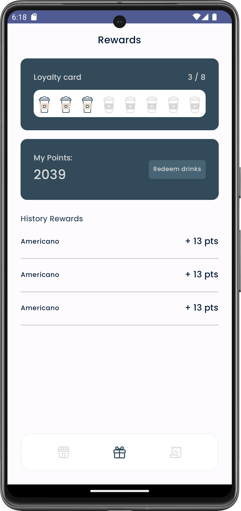

## Information
Coffee House is a coffee-ordering app. It is an offline demo of the typical flow of an online food-ordering app. It supports basic functions, including: customizing orders, adding to cart, checking out, viewing ongoing and history orders, collecting and redeeming rewards
## Techniques and implementations
-	The app is developed using the **Kotlin** programming language, and **Compose** as its UI framework.
-	This app uses **Navigation component** to navigate between composables.
## Screenshots

  
   
  
  
  
  
  

